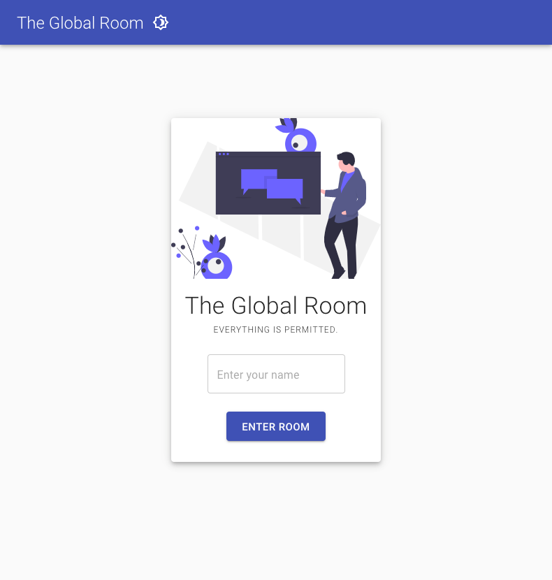

# 🚀 Position Based Audio Chatroom 🚀

<!--  -->

The purpose of our app is to give the user a more fluid and enjoyable online call
experience with friends or colleagues by redesigning the way the volume of other people in the
call is managed. Normally a user would have to adjust the volume of all the individuals in a call
or simply make another room from time to time in order to manage who they are listening to.
Our redesign involves making the online call into a virtual space that acts like a real room. In
this virtual space, members of a call are represented by a simple avatar and are displayed in a
large square room with all other members of the call. The distance between avatars directly
affects the volume of that member, making users closer to one another able to clearly hear each
other, and by contrast, users farther apart will be quieter to each other.


## Running application
### Frontend

```
npm start
```

### Backend
Ensure that python 3 is installed and the necessary packages are also installed.

To install packages run
```
pip install Flask
pip install flask-socketio
```


After dependencies are installed run
```
python app.py
```

## Documentation

### Frontend
Notable software documentation for our frontend technologies:

| Technology Name + Link                                        |                   Description                    |
| :------------------------------------------------------------ | :----------------------------------------------: |
| [React](https://reactjs.org/docs/getting-started.html)        | Javascript Framework for making web applications |
| [Material UI](https://mui.com/)                               |             React component library              |
| [Socket.io](https://socket.io/docs/v3/client-initialization/) | Library for realtime client-server communication |
| [p5js](https://p5js.org/)                                     | Library for interacting with the browser canvas  |
| [Simple Peer](https://github.com/feross/simple-peer)          |    Simplified WebRTC peer-to-peer connections    |


### Backend
Notable software documentation for our backend technologies:

| Technology Name + Link                                             |                       Description                       |
| :----------------------------------------------------------------- | :-----------------------------------------------------: |
| [Flask](https://flask.palletsprojects.com/en/2.0.x/)               |           Python library for making REST apis           |
| [Flask-Socketio](https://flask-socketio.readthedocs.io/en/latest/) | Python library for realtime client-server communication |
